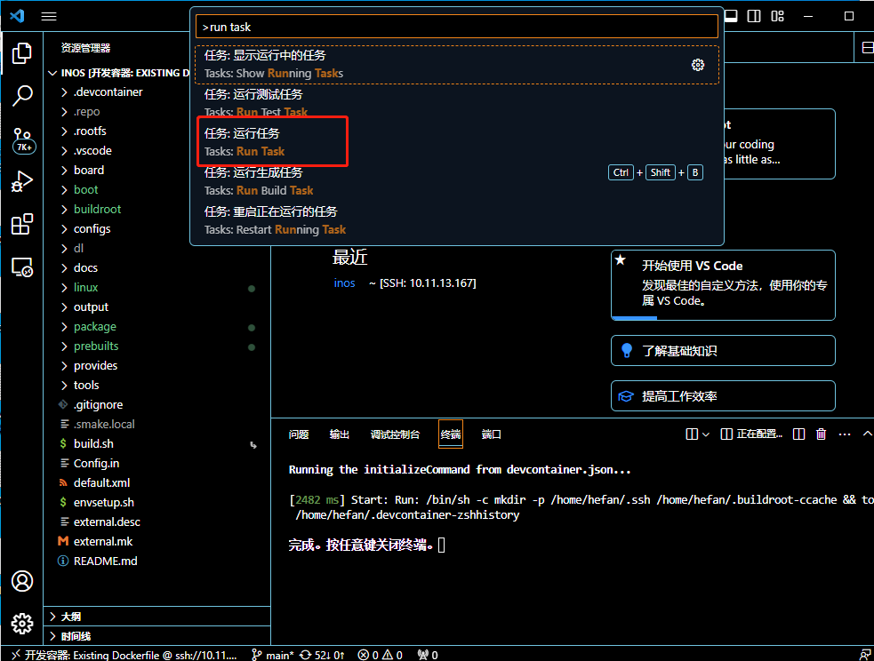

# VScode快速搭建arm64 INOS 开发环境说明

## 提示：请将inos/doc/images 拷贝到本文档同级目录，不然会出先图片加载不成功的情况

## 安装VScode环境

进入vscode官网（https://code.visualstudio.com），下载支持当前电脑版本的VScode，通过安装包一键安装VScode。


#### VScode下载插件

​	⦁ 安装Remote-ssh插件 

​	⦁ 安装Dev Containers 插件

​	⦁ 安装CMake Tools 插件

​	⦁ 安装rust-analyzer插件 

在搜索栏输入插件的名字并安装，全部安装完显示如下


## 搭建服务器环境

目前使用10.11.13.167作为开发服务器，在服务器上获取最新的inos工程

## 源码下载

- 安装repo

[repo的使用文档](https://source.android.com/docs/setup/create/repo?hl=zh-cn)。

```plaintext
curl https://mirrors.tuna.tsinghua.edu.cn/git/git-repo > /bin/repo
chmod a+x /bin/repo
```


- 下载

```plaintext
# 切换REPO_URL为清华镜像
export REPO_URL='https://mirrors.tuna.tsinghua.edu.cn/git/git-repo'
repo init -u ssh://git@gitlab.dros-cluster.com:10022/inos/inos.git
# 下载所有源码
repo sync -c
```


- 开发流程 使用repo的开发流程可参考[该文档](https://source.android.com/docs/setup/create/coding-tasks?hl=zh-cn)
  - repo start切换到项目的开发分支，例如`repo start main inos`
  - 修改文件
  - git add
  - git commit
  - 进入到对应的项目，执行git push

## 编译工程

> 需要在根目录下编译

第一次编译需要先执行`./envsetup.sh`，可以选择需要编译的目标板，比如当前我们使用的是ft2004_buildroot,这里选择2,如果是使用qemu_x86调试环境选择5.并且会把对应的config文件拷贝到buildroot，kernel和uboot中。

```plaintext
This script is executed directly...
Top of tree: /home/hefan/Phytium/inos-embeded

You're building on Linux
Lunch menu...pick a combo:

0. non-inos boards
1. barboard
2. hanwei_e2000q_buildroot
3. hanwei_ft2004_buildroot
4. hanwei_ft2004_initrd
5. inos
6. qemu_x86
   Which would you like? [0]:
```

编译x86_64工程的选择5，然后执行命令`cp buildroot/.config output`，然后执行命令smake（x86_64编译暂时使用这种方式）

如果buildroot包下载过慢，可以把10.11.13.167:/home/share/dl-2023-8-3/ 下的所有内容拷贝到根目录dl下

执行命令 `cp /home/share/dl-2023-8-3/* dl/ -rf`

## Remote-SSH环境准备

确保远端环境（服务器10.11.13.167）中SSH服务可用。

确保本地环境中支持SSH，这个可以通过安装Git来获取SSH功能。

## SSH密钥配置

本节将在Windows上生成SSH密钥，然后部署到服务器10.11.13.167中，这样每次重启VSCode之后，使用Remote-SSH访问服务器10.11.13.167中的文件时，不需要手动输入密码了。

### 生成SSH密钥文件

在Windows系统上执行下述命令生成SSH密钥：

```bash
ssh-keygen
```

输入上述命令之后，遇到等待时，直接按ENTER键保持默认，需要敲击3次ENTER键，然后就会在 `C:\Users\Administrator\.ssh` 目录中产生SSH密钥文件：`id_rsa` 和 `id_rsa.pub`。

### 部署密钥文件到服务器

首先，确保当前用户的用户目录下是否存在 `.ssh` 目录（我这里的完整路径为：`/home/hefan/.ssh` ），执行下述命令，查看输出信息中是否有 `.ssh` 目录：

```bash
ls -al ~
```

如果不存在 `.ssh` 目录，那么执行下述命令进行创建：

```bash
mkdir ~/.ssh
```

通过FTP，SFTP，samba等方式将生成的 `id_rsa.pub` 文件传输到服务器上的 `/home/hefan/.ssh` 目录中。

### 生成 authorized_keys 文件

进入 `/home/hefan/.ssh` 目录，然后使用下述命令，生成 `authorized_keys` 文件：

```bash
cat id_rsa.pub > authorized_keys
```

## Remote-SSH配置

下面将讲述一下Remote-SSH的一些配置，完成Remote-SSH的配置之后，就可以通过Remote-SSH访问服务器中的文件或者文件夹，就像在本地电脑开发一样。

打开VSCode，然后点击左侧的 “远程资源管理器” 图标，接着选择远程(隧道/SSH),然后点击右上角的小齿轮（设置）：


选择第一项，打开config文件，然后填写配置信息:


配置信息的文字内容如下：

```text
Host 10.11.13.167
    HostName 10.11.13.167
    User hefan
    IdentityFile C:\Users\Administrator\.ssh\id_rsa
```

上述配置信息的注释如下：

```text
Host <远程主机名称>
    HostName <远程主机IP>
    User <用户名>
    IdentityFile <本机SSH私钥路径>
```

在完成上述配置之后，输入ctrl+shift+p 选择Connect to Host in Current Window


选择刚刚新加的服务器10.11.13.167


然后platform选择linux，如果连接成功左下角显示当前已经连接的主机名:


## 通过VScode在容器内打开工程

上一步已经通过VScode连接上了10.11.13.167

点击打开文件夹选择之前在服务器上获取的inos工程代码


选择右下角的在容器中重新打开


左下角显示已经连接上了开发容器，此时我们的工程已经在服务器的容器中打开了

## 启动qemu

x86_64的qemu可以使用快捷键ctrl+shift+p，输入run task，选择tasks.json里配置好的qemu-system-aarch64运行.




运行成功显示如下，进入到qemu启动的系统中,可以看到inos的启动logo


